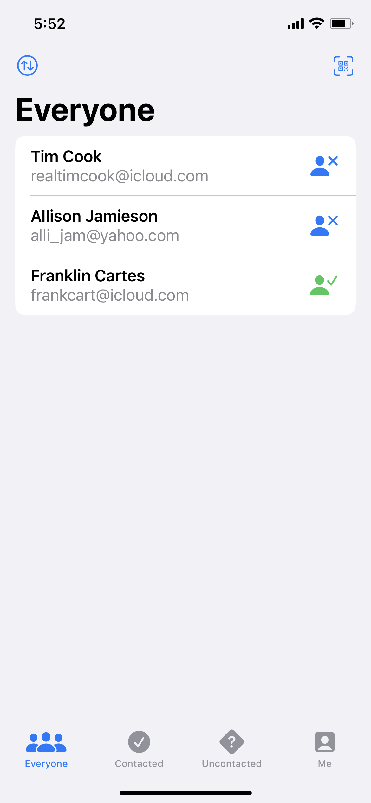
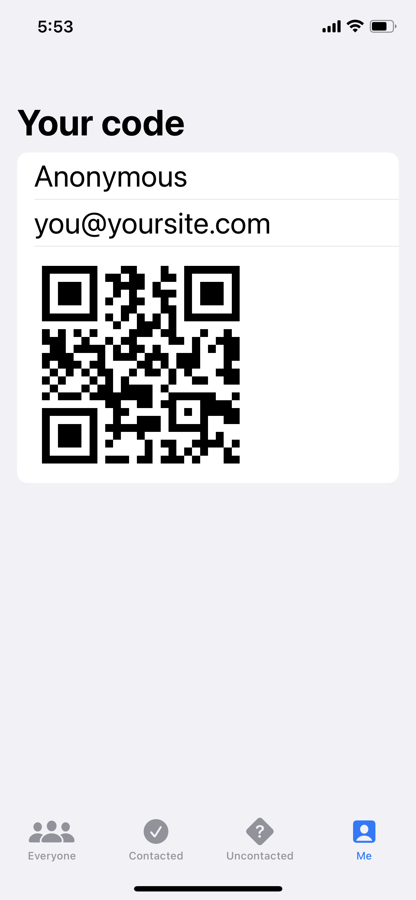

# HotProspects

A simple iOS app, built using SwiftUI, that allows peopole to track others they meet at conferences using QR codes.

## Installing / Getting started

To run this project, you will need a Mac computer with the latest version of Xcode and an iOS 15 Simulator set up. Simply clone the respository, open the project in Xcode, and run the app to get it working.

## Features

* Scan the QR codes of other people using HotProspects to store their name and email address
* Create a custom QR code for others to scan using your name and email address
* Filter contacts by who has been contacted using tabs
* Sort contacts by name or most recently added
* Mark as contacted/uncontacted, set a reminder, or delete contacts via swipe actions

## Credit

The idea for this project came from Paul Hudson's *100 Days of SwiftUI*. I may eventually add to this code, but credit for the base code goes to Paul Hudson. Links to each day on which material is referenced may be found below:

[Day 79 - HotProspects Part One](https://www.hackingwithswift.com/100/swiftui/79)

[Day 80 - HotProspects Part Two](https://www.hackingwithswift.com/100/swiftui/80)

[Day 81 - HotProspects Part Three](https://www.hackingwithswift.com/100/swiftui/81)

[Day 82 - HotProspects Part Four](https://www.hackingwithswift.com/100/swiftui/82)

[Day 83 - HotProspects Part Five](https://www.hackingwithswift.com/100/swiftui/83)

[Day 84 - HotProspects Part Six](https://www.hackingwithswift.com/100/swiftui/84)

[Day 85 - HotProspects Part Seven](https://www.hackingwithswift.com/100/swiftui/85)

## Screenshots

Screenshots will go here when they are ready.

    
    

